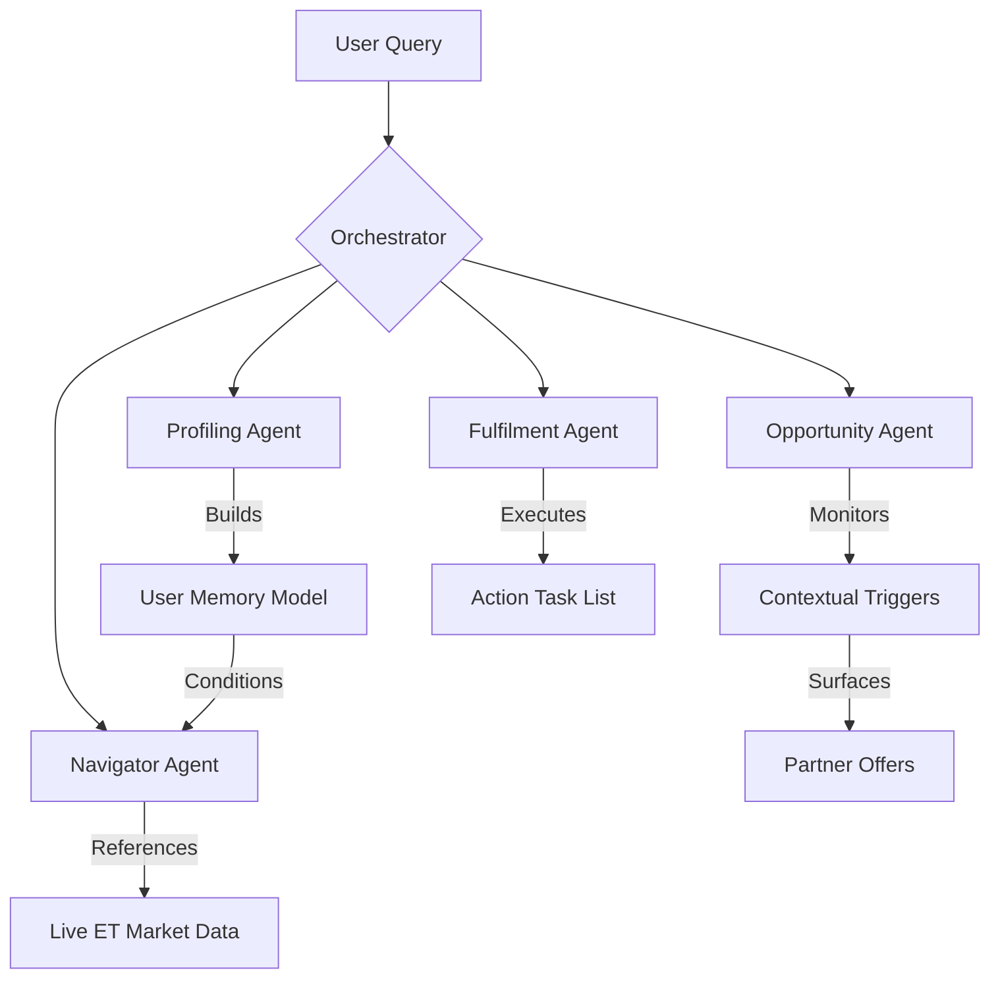

# ET Concierge System Architecture

## Overview
ET Concierge v2 is an **Agentic Financial Intelligence layer** built on top of the Economic Times ecosystem. It uses a **Multi-Agent Orchestration** pattern to provide proactive, data-grounded financial advice.

## Multi-Agent Workflow

## State Management
To solve the problem of "forgetful AI," we implement a **Session History Buffer** and a **Persistent User Profile Service**:

- **Behavioral Memory**: The `UserProfileService` stores the user's Discovery Score, Tier, and financial constraints (e.g., Retirement Gap of ₹29L).
- **Conversational Context**: Every prompt sent to the Navigator Agent includes the latest state of the User Profile and Live Market Data as a flattened context header. This ensures the AI always "knows" what the Profiler learned 2 minutes ago.
- **Agent Hand-off**: The Orchestrator (`ChatService`) evaluates the intent of every message. If the intent crosses a threshold (e.g., "apply"), the state is passed from the Navigator to the Fulfilment Agent to generate actionable steps.

## Tool Integrations & Data Grounding
To ensure high-fidelity financial advice, the agents leverage a multi-source integration layer:
- **Yahoo Finance API**: Real-time market data for primary indices (NIFTY 50, SENSEX) and individual stock tickers.
- **Google Search (Custom Search API)**: Deep-crawls the ET Prime and ET Markets ecosystem for news-based sentiment and wealth summit schedules.
- **ET Partner Ecosystem**: Simulated hooks for HDFC (Loans), Axis (Credit Cards), and Mirae Asset (Mutual Funds) to demonstrate fulfilment capabilities.

## Error-Handling & Resiliency
The system is designed with a **"Fail-to-Local"** architecture:
- **API Fallback**: If the Gemini API or Search API fails (quota limits or network issues), the system automatically triggers a **Local Rule Engine**. This engine uses a set of high-quality, profile-matched templates to ensure the user experience remains "agentic" and data-grounded without a hard failure.
- **State Restoration**: If a session is interrupted, the `UserProfileService` persists the current "Discovery Score" and "Knowledge State," allowing the agents to resume context-heavy conversations smoothly.

## Technical Debt & Scalability
- **Real-time Hooks**: Current implementation uses a free-tier Yahoo Finance fallback. Future versions will integrate direct NSE/BSE API hooks for sub-second accuracy.
- **SSO Integration**: The architecture is designed to connect to ET Prime's SSO for seamless user identification and premium content gating.

