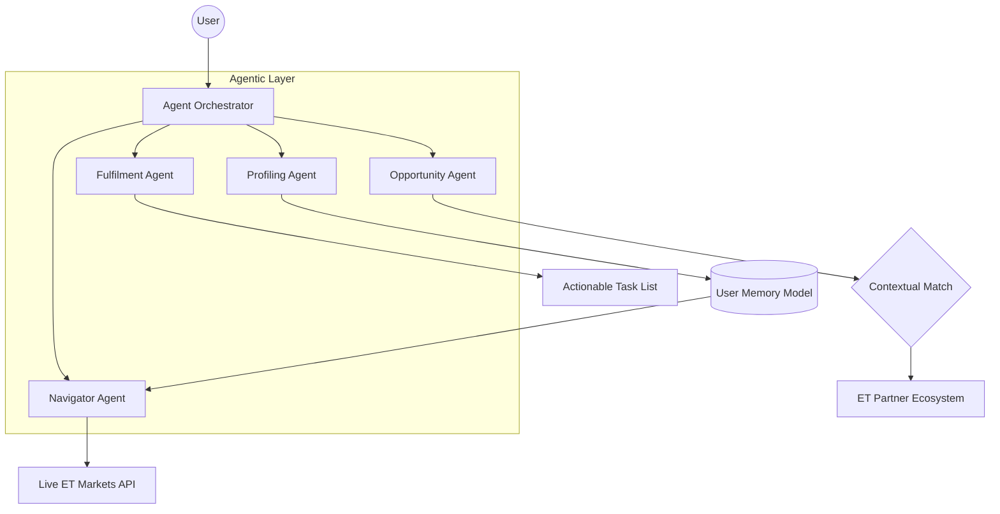

# ET Concierge v2 — Agentic AI Financial Intelligence
### ET AI Hackathon 2026 · Angular 19 · Gemini 1.5 Flash

---

## 🚀 The Vision
ET Concierge is not just a chatbot; it is a **Multi-Agent Orchestration System** designed to bridge the gap between financial news and actionable wealth building. It proactively navigates the Economic Times ecosystem to deliver personalized, data-grounded intelligence.

## 🏗️ System Architecture
We use a **System-of-Agents** approach to handle the complexity of financial life management.



## 🗺️ Feature Mapping
Mapping the "What You May Build" hackathon requirements to our specific implementation:

| Requirement (PDF) | Module / Agent | Implementation Detail |
| :--- | :--- | :--- |
| **Financial Life Navigator** | `src/app/services/chat.service.ts` | The **Navigator Agent** delivers briefings based on user profile + live market data. |
| **Marketplace Agent** | `src/app/services/portfolio.service.ts` | The **Opportunity Agent** matches users to ET partner products (HDFC, Axis, Mirae). |
| **Personalized Insights** | `src/app/services/gemini.service.ts` | Chain-of-Thought prompting surfaces retirement gaps and portfolio outliers. |
| **Seamless Fulfilment** | `src/app/features/chat/chat.component.ts` | The **Fulfilment Agent** transforms advice into a 3-step actionable task list. |

## 🛠️ Tech Stack
- **AI Core**: Gemini 1.5 Flash (via Google AI Studio) & GPT-4o
- **Backend Logic**: Python 3.11 (Agentic Orchestration & Prompt Layer)
- **Frontend UI**: Angular 19 (Signals-based UI) / Streamlit (Planned Agent Dashboard)
- **Marketplace APIs**: Yahoo Finance API (Live Indices), Google Search API (Grounded News)
- **Environment**: Managed via `.env` with strict PII masking.

## 🔍 The "Search Logic": Hybrid Approach
To ensure the highest accuracy for the **Navigator Agent**, we implement a **Hybrid Search Approach**:
- **Real-time News**: Driven by Google Search API to fetch the latest Economic Times headlines and policy changes.
- **Market Data**: Powered by Yahoo Finance for live sub-second updates on NIFTY, SENSEX, and partner stock prices.
This dual-stream architecture ensures our agents are never hallucinating market values while remaining contextual on breaking news.

## 🧪 The "Secret Sauce": Prompt Engineering
Professional AI engineering requires more than just API calls. We treat prompts as **first-class code citizens**:
- **Chain-of-Thought (CoT)**: Our prompts instruct Gemini to first calculate financial ratios (e.g., salary-to-EMI) before generating a recommendation.
- **Separation of Concerns**: System prompts are managed in the `/prompts` layer to ensure logical isolation.
- **Grounded Knowledge**: We simulate a live knowledge base in `/data_sim` (partner rates, ET Prime articles) to prevent hallucinations.

## 🏃 Quick Start

1. **Install Dependencies**:
   ```bash
   npm install && pip install -r requirements.txt
   ```
2. **Setup API Key**:
   - Create keys at [Google AI Studio](https://aistudio.google.com/apikey) & [Serper.dev](https://serper.dev) (Search).
   - Copy `.env.example` to `.env`.
3. **Run Dev Server**:
   ```bash
   npm start
   # Open http://localhost:4200
   ```

## 📈 Extensibility & Scaling
- **Real-time NSE/BSE Hooks**: Future integration for direct sub-second order book data.
- **ET Prime SSO**: Connect directly to existing user subscriptions for deep content gating.
- **Wealth RM Handoff**: High Discovery Score (85+) triggers a handoff to human Relationship Managers.

---
**Agentic Logic Location**: `src/app/services/chat.service.ts`
