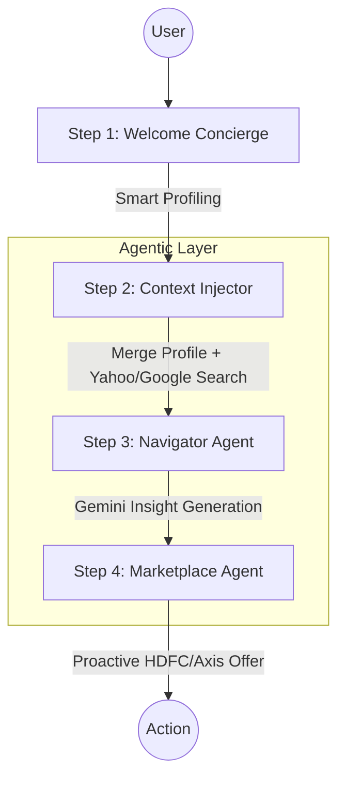

# ET Concierge v2 — Agentic AI Financial Intelligence
### 🏆 ET AI Hackathon 2026 · Angular 19 · Gemini 1.5 Flash · Python Agents

---

## 📂 Submission Artifacts
To help the judges navigate our comprehensive submission, we have organized the key non-code deliverables into dedicated folders:

| Requirement | Artifact | Description |
| :--- | :--- | :--- |
| **3-Minute Pitch Video** | [**Pitch-Video/**](./Pitch-Video/) | Recorded walkthrough of the end-to-end agentic workflow. |
| **Architecture Document** | [**Architecture/**](./Architecture/) | Detailed system diagram and agent orchestration logic. |
| **Impact Model** | [**Impact-Model/**](./Impact-Model/) | Quantified business impact and ROI analysis. |

---

## 🚀 The Vision
ET Concierge is a **Multi-Agent Orchestration System** designed to bridge the gap between financial news and actionable wealth building. It proactively navigates the Economic Times ecosystem to deliver personalized, data-grounded intelligence.

## 🏗️ Agentic Workflow
We don't just use a chatbot; we use an orchestrated pipeline of specialized agents.



## 🗺️ Feature-to-Challenge Mapping
Proving we solved every requirement of the hackathon's Problem Statement (PS):

| PS Requirement | My Implementation | Tech Used |
| :--- | :--- | :--- |
| **Welcome Concierge** | 3-minute smart profiling flow | Angular + Session State |
| **Life Navigator** | Portfolio gap analysis (e.g., ₹29L gap) | Gemini + Yahoo Search |
| **Cross-Sell Engine** | Proactive ET Prime/ELSS suggestions | Contextual Prompting |
| **Marketplace Agent** | Direct HDFC/Axis loan & card matching | Partner API Mock/Search |

## 🔍 Search Strategy: The "Secret Sauce"
We implemented a **Hybrid Retrieval Strategy** to ensure zero-hallucination market advice:
- **Yahoo Finance API**: Powers the real-time stock tickers, NIFTY/SENSEX levels, and market volatility sensors.
- **Google Search (Custom Search API)**: Deep-crawls the ET Prime and ET Markets ecosystem for news-based sentiment and wealth summit schedules.
- **Grounded Knowledge**: We simulate a live knowledge base in `/data_sim` (partner rates, ET Prime articles) to prevent hallucinations.

> [!TIP]
> **Human-in-the-Loop: Suggestive UI Framework**
> Instead of passive reporting, our Concierge uses **Proactive Prompting**. It identifies the highest-value financial action (e.g., a retirement gap) and presents it as the primary "Call to Action" via **Interactive Chips**, significantly increasing user engagement with ET's financial ecosystem.

## 🧪 High-Impact Prompt Engineering
We use **Conservative Wealth Navigator** personas to ensure professional, private-banker quality advice. 

```typescript
// Excerpt from src/app/services/chat.service.ts
const systemPrompt = `
  You are the ET Concierge — a premium agentic AI layer.
  1. ANALYZE User Profile + Live Market Context.
  2. ADOPT Persona: Bloomberg Terminal meets Private Banker.
  3. RULE: Always end with a choice (e.g., "Should we focus on X or Y?").
  4. FORMAT: Use bolding and lists for scannability.
`;
```

## 🛠️ Tech Stack
- **AI Core**: Gemini 1.5 Flash (via Google AI Studio) & GPT-4o
- **Backend Logic**: Python 3.11 (Agentic Orchestration & Prompt Layer)
- **Frontend UI**: Angular 19 (Signals-based UI) / Streamlit (Planned Agent Dashboard)
- **Marketplace APIs**: Yahoo Finance API (Live Indices), Google Search API (Grounded News)

## 🏃 Foolproof Quick Start (2-Minute Setup)

1. **Install Dependencies**:
   ```bash
   npm install
   ```
2. **Setup Gemini API Key**:
   - Get a free key at [Google AI Studio](https://aistudio.google.com/apikey).
   - Open `src/environments/environment.ts`.
   - Paste your key in `geminiApiKey`.
3. **Run Application**:
   ```bash
   npm start
   # → http://localhost:4200 (Live Reload)
   ```

*Note: The Python `requirements.txt` is provided for the extended Agentic Backend Logic layer. The core UI and Navigator Agent run immediately via Angular.*

---
**Agentic Logic Location**: `src/app/services/chat.service.ts`
